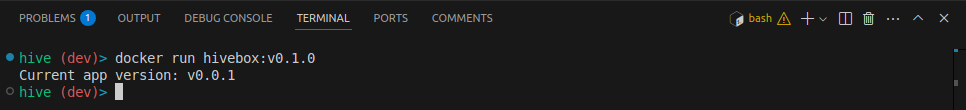
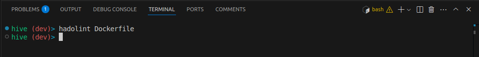
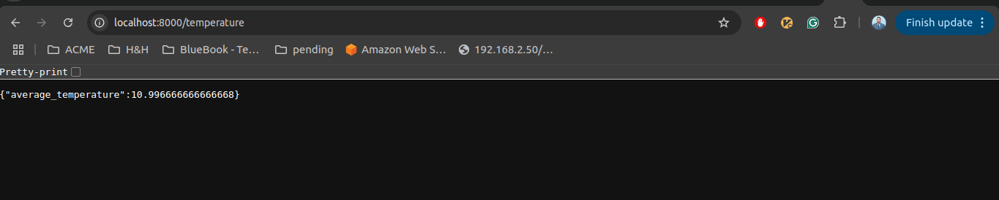

# Hive-box

## Introduction

> Note: This project is currently under development.

Welcome to the ambitious project aimed at revolutionizing beekeeping through the development of a comprehensive and scalable RESTful API. The primary objective of this endeavor is to leverage the power of [OpenSenseMap](https://www.opensensemap.org/) to provide a robust platform that caters specifically to the needs of beekeepers, streamlining their daily chores and enhancing overall efficiency.. Finally, I'd like to express gratitude to [Ahmed AboZied](https://www.linkedin.com/in/aabouzaid/) and [DevOps Hive](https://devopshive.net/), particularly for their contribution to the [dynamic-devops-roadmap](https://github.com/DevOpsHiveHQ/dynamic-devops-roadmap/tree/main). 

[](https://github.com/DevOpsHiveHQ/dynamic-devops-roadmap)

## Phase 1 

## Phase 2

Note that I Will use [GitFlow](https://www.atlassian.com/git/tutorials/comparing-workflows/gitflow-workflow) in This project.  

* Create Dev branch 

  ```bash 
  git branch dev 
  ```

* Create and checkout feature branch 

  ```bash 
  git checkout -b feature/implement-versioning
  ```

* Create Simple version function 
  ```python
  def print_version():
      version = "v0.0.1"
      print(f"Current app version: {version}")
  
  if __name__ == "__main__":
      print_version()
  ```

  

* Implementing the versioning code changes in `versionFunction.py` file 

  ```bash 
  git add versionFunction.py
  git commit -m "Implement versioning"
  ```

* merge feature branch into dev 

  ```bash 
  git switch dev 
  git merge feature/implement-versioning 
  ```

* Create release branch for Docker configuration 

  ```bash 
  git checkout -b release/v0.1.0 
  ```

* Create project Dockerfile
  ```Dockerfile
  FROM python:3.8
  WORKDIR /app
  COPY . /app
  ENV PYTHONUNBUFFERED 1
  #RUN pip install --no-cache-dir -r requirements.txt
  CMD ["python", "./main.py"]
  ```

* Adding Dockerfile to project 

  ```bash 
    git add Dockerfile 
    git commit -m "Add Docker File for release v0.1.0"
  ```

* Merge Release branch into "Master" and "dev" branch 

  ```bash 
  git switch dev 
  git merge release/v0.1.0 
  
  git switch master 
  git merge dev
  ```

* Create version tag

  ```bash
  git tag -a v0.1.0 -m "Release v01.0"
  git push origin --tags 
  ```

* Switch to development branch build/run Docker image

  ```bash 
  git switch dev 
  docker build -t hivebox:v0.1.0 . 
  docker run hivebox:v0.1.0 
  ```

  Here you should sea that you app is up and running! 

  

* Push Changes to remote repo 

  ```bash 
  git push origin dev 
  git push origin master 
  git push origin --tags 
  ```


## Phase 3

### 3. 1Tools

1. **Hadolint**: A command-line tool that helps ensure your Dockerfiles follow best practices and parses your Dockerfile into an abstract syntax tree (AST).

   - Installation:

     ```bash 
     sudo apt-get install shellcheck -y
     wget https://github.com/hadolint/hadolint/releases/download/v2.12.0/hadolint-Linux-x86_64
     sudo mv hadolint-Linux-x86_64 /usr/local/bin/hadolint
     sudo chmod +x /usr/local/bin/hadolint
     ```

   - Test your Dockerfile:

     `````bash 
     hadolint --verbose Dockerfile
     `````

     If there is no output, this means that there are no errors in your Dockerfile.
     
     
     
     

2. **Pylint**: A static code analysis tool for Python that checks Python code for errors, potential bugs, and enforces coding standards. It examines Python code and provides feedback on various aspects of the code's quality.

   * Installation:

     ````bash 
     pip install pylint
     sudo apt install pylint
     ````

     

- Test your Python file:

  ````bash 
  pylint main.py
  ````

### 3.2 Code  

In this phase I decide that I should Create to component for application Frontend and Backend which is simple [FastAPI](https://fastapi.tiangolo.com/tutorial/first-steps/) app containing two endpoints. The first endpoint returns the **version** of the app, while the second endpoint returns the **average temperature** of three box IDs: [5eba5fbad46fb8001b799786](https://opensensemap.org/explore/5eba5fbad46fb8001b799786), [5e02b67d475fc6001a132e31](https://opensensemap.org/explore/5e02b67d475fc6001a132e31), and [5eba5fbad46fb8001b799786](https://opensensemap.org/explore/5eba5fbad46fb8001b799786) . After implementing the endpoints, I wrote a simple unit test to ensure the functionality of this app. I also used [Conventional commits](https://www.conventionalcommits.org/en/v1.0.0/) in Git, which are a standardized way to structure commit messages.

- Create new branch `feature/temperatureEndpoint`

  ```bash 
  git branch feature/temperatureEndpoint 
  git switch feature/temperatureEndpoint 
  ```

- Create `Backend` folder and `main.py` file 

  ```bash
  mkdir backend 
  mv versionfunction backend/main.py 
  mv Dockerfile backend/Dockerfile
  ```

- Add the following code to main.py file 
  ```python
  from fastapi import FastAPI, HTTPException
  import requests
  
  app = FastAPI()
  
  # Hardcoded sensebox IDs
  SENSEBOX_IDS = [
      "5eba5fbad46fb8001b799786",
      "5eb99cacd46fb8001b2ce04c",
      "5e60cf5557703e001bdae7f8"
  ]
  
  @app.get("/version")
  def read_version():
      return {"version": "v0.0.1"}
  
  @app.get("/temperature")
  def read_temperature():
      temperatures = []
      for box_id in SENSEBOX_IDS:
          response = requests.get(
              f"https://api.opensensemap.org/boxes/{box_id}?format=json"
          )
          if response.status_code != 200:
              continue
          
          data = response.json()
          for sensor in data["sensors"]:
              if (
                  sensor["title"] == "Temperatur"
                  and "lastMeasurement" in sensor
              ):
                  last_measure = sensor["lastMeasurement"]
                  if last_measure is not None and "value" in last_measure:
                      temperature = float(last_measure["value"])
                      temperatures.append(temperature)
                      break
  
      if not temperatures:
          raise HTTPException(status_code=404, detail="No temperature data found")
  
      average_temperature = sum(temperatures) / len(temperatures)
  
      return {
          "average_temperature": average_temperature
      }
  
  if __name__ == "__main__":
      import uvicorn
      uvicorn.run(app, host="0.0.0.0", port=8000)
  ```

- Run Code with `python3 main.py` and try to call your different endpoints. This is the result 
  

- Merge `feature/temperatureEndpoint` branch into `dev` branch. 

  ```bash 
  git switch dev 
  git merge feature/temperatureEndpoint
  ```

  