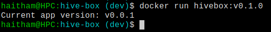

# Hive-box
> **Note:** This project is currently under development.

## Introduction 
Note: This project is currently under developme

Welcome to the ambitious project aimed at revolutionizing beekeeping through the development of a comprehensive and scalable RESTful API. The primary objective of this endeavor is to leverage the power of [OpenSenseMap](https://www.opensensemap.org/) to provide a robust platform that caters specifically to the needs of beekeepers, streamlining their daily chores and enhancing overall efficiency. A distinctive aspect of this project is the commitment to document each phase comprehensively. This documentation effort will provide a transparent and insightful journey into the development process, offering valuable resources for users, developers, and beekeeping enthusiasts alike. Finally, I'd like to express gratitude to [Ahmed AboZied](https://www.linkedin.com/in/aabouzaid/) and [DevOps Hive](https://devopshive.net/), particularly for their contribution to the [dynamic-devops-roadmap](https://github.com/DevOpsHiveHQ/dynamic-devops-roadmap/tree/main). 

## Phase 1 

I have successfully completed Phase One of the project, which focused on the "Welcome to the DevOps World" module. During this phase, I  clarified team roles and fostered collaboration across teams.  Additionally, I deepened my understanding of Software Project  Management, with a specific emphasis on Agile principles. The chosen  Agile methodology for this project is Scrum, and I have diligently  documented each step, anticipating the importance of project  transparency.

## Phase 2 

Project requirements 

1. Create a function that print current app version `versionFunction.py`

   ```python 
   def print_version():
       version = "v0.0.1"
       print(f"Current app version: {version}")
   
   if __name__ == "__main__":
       print_version()
   ```

2. Create and build docker image  

   ```Dockerfile
   FROM python:3.8
   WORKDIR /app
   COPY . /app
   ENV PYTHONUNBUFFERED 1
   #RUN pip install --no-cache-dir -r requirements.txt
   CMD ["python", "./main.py"]
   ```

Note that I Will use [GitFlow](https://www.atlassian.com/git/tutorials/comparing-workflows/gitflow-workflow) in This project.  

* Create Dev branch 

  ```bash 
  git branch dev 
  ```

* Create and checkout feature branch 

  ```bash 
  git checkout -b feature/implement-versioning
  ```

* Implementing the versioning code changes in `versionFunction.py` file 

  ```bash 
  git add versionFunction.py
  git commit -m "Implement versioning"
  ```

* merge feature branch into dev 

  ```bash 
  git checkout dev 
  git merge feature/implement-versioing 
  ```

* Create release branch for Docker configuration 

  ```bash 
  git checkout -b release/v0.1.0 
  ```

* Adding Dockerfile to project 

  ```bash 
    git add Dockerfile 
    git commit -m "Add Docker File for release v0.1.0"
  ```

* Merge Release branch into "Master" and "dev" branch 

  ```bash 
  git checkout dev 
  git merge release/v0.1.0 
  
  git checkout master 
  git merge release/v0.1.0
  ```

* Create version tag

  ```bash
  git tag -a v0.1.0 -m "Release v01.0"
  ```

* Switch to development branch build/run Docker image

  ```bash 
  git checkout dev 
  docker build -t hivebox:v0.1.0 . 
  docker run hivebox:v0.1.0 
  ```

  Here you should sea that you app is up and running! 

  

* Push Changes to remote repo 

  ```bash 
  git push origin dev 
  git push origin master 
  git push origin --tags 
  ```


## Phase 3

### 3. 1Tools

1. **Hadolint**: A command-line tool that helps ensure your Dockerfiles follow best practices and parses your Dockerfile into an abstract syntax tree (AST).

   - Installation:

     ```bash 
     sudo apt-get install shellcheck -y
     wget https://github.com/hadolint/hadolint/releases/download/v2.12.0/hadolint-Linux-x86_64
     sudo mv hadolint-Linux-x86_64 /usr/local/bin/hadolint
     sudo chmod +x /usr/local/bin/hadolint
     ```

   - Test your Dockerfile:

     `````bash 
     hadolint --verbose Dockerfile
     `````

     If there is no output, this means that there are no errors in your Dockerfile.

2. **Pylint**: A static code analysis tool for Python that checks Python code for errors, potential bugs, and enforces coding standards. It examines Python code and provides feedback on various aspects of the code's quality.

   * Installation:

     ````bash 
     pip install pylint
     sudo apt install pylint
     ````

     

- Test your Python file:

  ````bash 
  pylint main.py
  ````

### 3.2 Code 

I use [Conventional commits](https://www.conventionalcommits.org/en/v1.0.0/) in Git, which are a standardized way to structure commit messages. I created a simple [FastAPI](https://fastapi.tiangolo.com/tutorial/first-steps/) app containing two endpoints. The first endpoint returns the **version** of the app, while the second endpoint returns the **average temperature** of three box IDs: [5eba5fbad46fb8001b799786](https://opensensemap.org/explore/5eba5fbad46fb8001b799786), [5e02b67d475fc6001a132e31](https://opensensemap.org/explore/5e02b67d475fc6001a132e31), and [5eba5fbad46fb8001b799786](https://opensensemap.org/explore/5eba5fbad46fb8001b799786) . After implementing the endpoints, I wrote a simple unit test to ensure the functionality of this app.

* Create release branch for code implementation 

  ```bash 
  git checkout -b release/v3.2.0 
  ```

* Adding Dockerfile to project 

  ```bash 
   c
    git commit -m "adding app for release v3.2.0 "
  ```

* Merge Release branch into "Master" and "dev" branch 

  ```bash 
  git checkout dev 
  git merge release/v3.2.0  
  
  git checkout master 
  git merge release/3.2.0 
  ```

* Create version tag

  ```bash
  git tag -a v3.2.0  -m "Release v3.2.0 "
  ```

### 3.3 Containers 
To ensure optimal performance and security in your Docker containers, use a minimal base image like alpine to reduce the image size and specify a version instead of using latest. This approach decreases the attack surface and speeds up deployment times.
### 3.4 Continuous Integration. 


